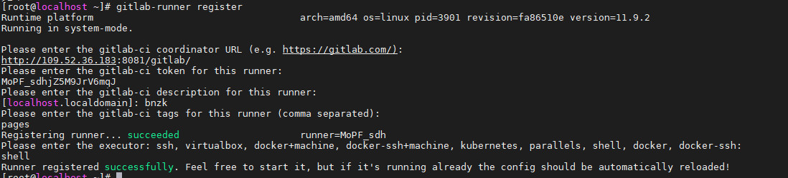
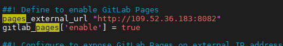

# Pages

## 安装和注册gitlabrunner
```
curl -s https://packages.gitlab.com/install/repositories/runner/gitlab-runner/script.rpm.sh | sudo bash
yum install -y gitlab-runner.x86_64-11.9.2-1
```

注册runner




TODO: gitlab与gitlab-runner版本额对应关系


## 启用Pages

```
vim /etc/gitlab/gitlab.rb
```


```
gitlab-ctl reconfigure
gitlab-ctl restart
```

## 第一个Pages站点