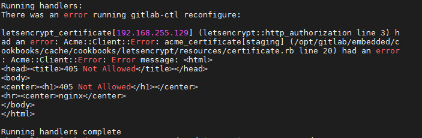
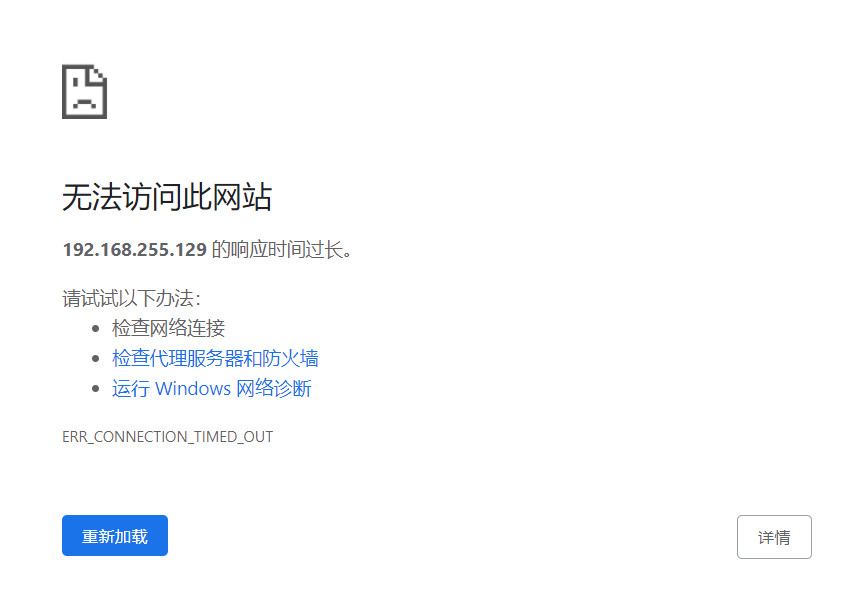
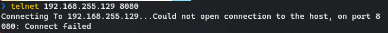
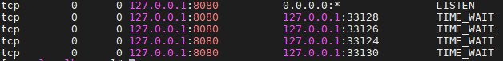
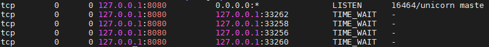
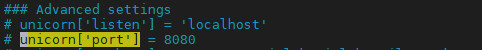
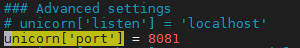
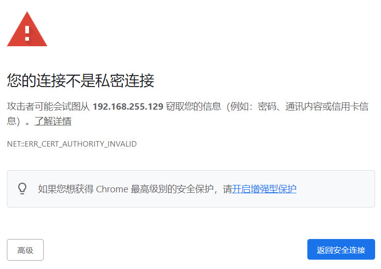
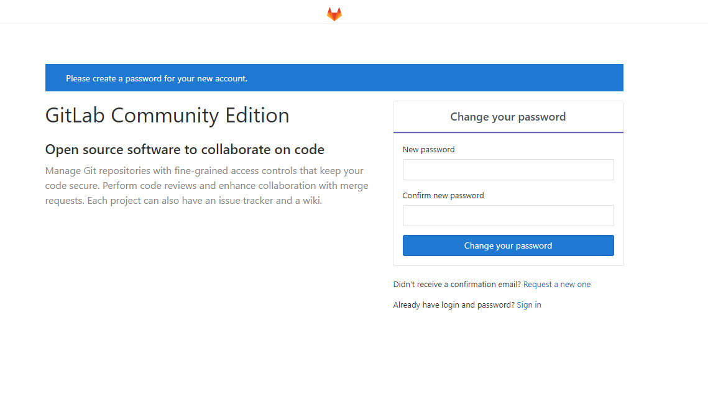

# 安装
参考[官方文档](https://about.gitlab.com/install/#centos-7)

## 安装过程

### 安装和配置基本依赖

下面的命令安装必要的以来，在系统防火墙上打开对HTTP，HTTPS，SSH的访问。

```bash
sudo yum install -y curl policycoreutils-python openssh-server perl
# Enable OpenSSH server daemon if not enabled: sudo systemctl status sshd
sudo systemctl enable sshd
sudo systemctl start sshd
# Check if opening the firewall is needed with: sudo systemctl status firewalld
sudo firewall-cmd --permanent --add-service=http
sudo firewall-cmd --permanent --add-service=https
sudo systemctl reload firewalld
```

下面的命令安装并配置postfix服务。用来发送通知邮件。如果使用外部SMTP服务器发送通知邮件，参考[配置外部SMTP服务器](https://docs.gitlab.com/omnibus/settings/smtp.html)
```bash
sudo yum install postfix
sudo systemctl enable postfix
sudo systemctl start postfix
```
安装postfix过程中，会出现一个配置界面，选择'Internet Site'并按下回车键。使用服务器的外部DNS作为'mail name' 然后按下回车键。如果出现一个'additional'界面，按下回车键使用默认配置。

### 添加GitLab包的仓库并安装

添加gitlab软件包仓库
```bash
curl https://packages.gitlab.com/install/repositories/gitlab/gitlab-ce/script.rpm.sh | sudo bash
```

接下来，安装GitLab.安装前确保[正确配置DNS](https://docs.gitlab.com/omnibus/settings/dns.html)，并且将https://gitlab.example.com更改为你的Gitlab实例的URL。安装会自动配置并在设置的URL上启动GitLab。

对于```https://```开头的URL,GitLab会[自动使用Let's Encrypt请求一个证书](https://docs.gitlab.com/omnibus/settings/ssl.html#lets-encrypthttpsletsencryptorg-integration)，这需要一个入站HTTP访问和一个有效的主机名。你也可以使用[自己的证书](https://docs.gitlab.com/omnibus/settings/nginx.html#manually-configuring-https)或者使用```http://```(没有```s```)

如果你想要为初始系统管理员(root)指定密码，请查看[文档](https://docs.gitlab.com/omnibus/installation/index.html#set-up-the-initial-password)。否则会随机生成一个密码。

```
sudo EXTERNAL_URL="https://192.168.255.129:8080/gitlab/" yum install -y gitlab-ce-11.4.7
```

### 登录GitLab的初始用户和密码

除非在安装的时候提供了自定义的密码，否则一个随机密码将在```/etc/gitlab/initial_root_password```中被保存24小时。用```root``用户登录时使用这个密码。

安装和配置的详细说明请查看[文档](https://docs.gitlab.com/omnibus/installation/index.html)

### 配置你的通讯首选项
访问[邮件订阅配置中心](https://about.gitlab.com/company/preference-center/)来让我们知道什么时候与你通信。我们有一个清晰的邮件选择策略，所以你可以完全控制我们想你发送邮件的内容和频率。

**注意：**如果你没有选择安全通讯，你将不会收到安全警告。

### 推荐的下一个步骤

当完成安装后，考虑一下[推荐的下一个步骤](https://docs.gitlab.com/ee/install/next_steps.html)，包括认证设置和注册限制


## 填坑

### 安全证书有关额错误

因为安装时指定的url时```https```协议的。根据官方文档，GitLab会[自动使用Let's Encrypt请求一个证书](https://docs.gitlab.com/omnibus/settings/ssl.html#lets-encrypthttpsletsencryptorg-integration)。在配置安全证书的过程中出现以下错误



TODO: 了解原因并解决

### 使用URL无法访问GitLab

初次使用URL访问GitLab时提示无法访问

#### 防火墙



首先使用telnet查看端口是否可以访问



结果显示无法访问。

到GitLab主机上查看端口是否已经开启

```
netstat -na | grep 8080
```



结果显示8080正在被监听。推断应该时防火墙的问题。但按照上面的步骤已经在防火墙已经允许了```HTTPS```协议的访问。

后来意识到，其中的端口号是8080，而```HTTPS```的默认端口号是443。所以防火墙上应该允许通过8080端口访问。

```
sudo firewall-cmd --permanent --zone=public --add-port=8080/tcp
sudo systemctl reload firewalld
```

#### 8080 端口冲突

检查监听8080端口的进程

```
netstat -nap | grep 8080
```



发现监听8080端口的进程是unicorn maste，而不是nginx。

查看资料了解到unicorn是Ruby的Http Server，它的默认端口是8080，nginx是unicorn的反向代理。安装时设置的url实际上是为nginx提供的。解决这个问题的方法有两种
1. 修改URL中端口号，设置为其他端口
2. 修改unicorn的端口号

这里采用第二种方法。打开gitalb的全局配置文件```/etc/gitlab/gitlab.rb```
```
sudo vim /etc/gitlab/gitalb.rb
```

找到如下配置



其中高亮的配置项指定unicorn监听的端口号。
删掉高亮行最前面的```#```,将监听端口号修改为8081(设置前确保端口号没有被占用)，如下图：



重新加载配置

```
sudo gitlab-ctl reconfigure
```

重启gtialb

```
sudo gitlab-ctl restart
```

重新使用URL访问GitLab

提示



点击```高级```按钮，再点击```继续前往192.168.255.129（不安全）```链接。进入GitLab页面修改密码


