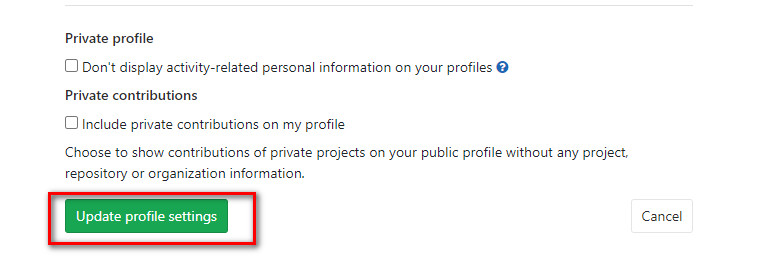

# 汉化

## 汉化过程

安装git,patch

```
sudo yum install -y git patch
```

获取GitLab版本

```
gitlab_version=$(sudo cat /opt/gitlab/embedded/service/gitlab-rails/VERSION)
echo $gitlab_version
```

克隆汉化版仓库

```
git clone https://gitlab.com/xhang/gitlab.git
```

比较汉化版标签和原版标签，导出patch用的diff文件

```
export IGNORE_DIRS=':!qa :!spec :!features :!.gitignore :!.gitlab :!locale :!app/assets/ :!vendor/assets/'
git diff --diff-filter=d  v${gitlab_version}..v${gitlab_version}-zh -- . ${IGNORE_DIRS} > ../${gitlab_version}-zh.diff
```

**注意：** 由于git版本的问题，上面的命令会执行失败。如下图所示。


解决的办法有两种： 1. 升级git。2. 在其他有高版本git的主机上生成diff文件，然后上传到GitLab服务器执行后面的步骤。

这里采用第二种方法


导入汉化补丁
```
sudo gitlab-ctl stop
sudo patch -d /opt/gitlab/embedded/service/gitlab-rails -p1 < ${gitlab_version}-zh.diff
```

将git库汉化版中的```app/assets```和```vendor/assets``` 分别拷贝到 ```/opt/gitlab/embedded/service/gitlab-rails/app/```和```/opt/gitlab/embedded/service/vendor/```

```
git checkout v${gitlab_version}-zh
cp -R app/assets /opt/gitlab/embedded/service/gitlab-rails/app/
mkdir -p /opt/gitlab/embedded/service/gitlab-rails/vendor
cp -R vendor/assets /opt/gitlab/embedded/service/gitlab-rails/vendor/
```

重新生效配置并重启gitlab
```
gitlab-ctl reconfigure
gitlab-ctl restart
```

用户登录后，按照下面图片的步骤设置语言

点击用户头像


选择settings


在打开的页面中找到```Preferred Language```,设置为```简体中文```


点击页面最下方的```Update profile settings```按钮



刷新页面

