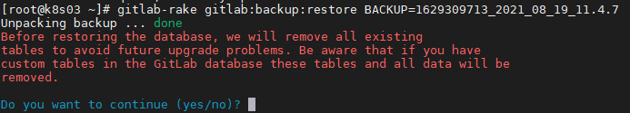
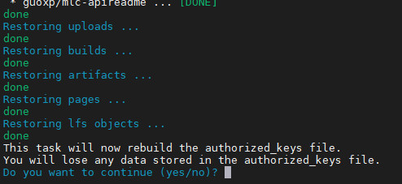

# 维护

## 数据备份

### 手动备份

在GitLab服务器上执行如下命令
```
sudo gitlab-rake gitlab:backup:create
```

命令执行成功后，会在```/var/opt/gitlab/backups```目录下生成备份后的文件，如```1628841913_2021_08_13_11.4.7_gitlab_backup.tar```。其中，时间错1628841913，表示从1970年1月1日0时开始到当前时间的秒数。备份文件中包含了GitLab的所有数据。

### 自动备份
**TODO:**


## 数据恢复

将备份的数据文件(如`1628841913_2021_08_13_11.4.7_gitlab_backup.tar`)拷贝到gitlab备份目录中(默认`/var/opt/gitlab/backups`)
```
cp 1628841913_2021_08_13_11.4.7_gitlab_backup.tar /var/opt/gitlab/backups/
```

停止相关的数据库链接服务
```bash
gitlab-ctl stop unicorn
gitlab-ctl stop sidekiq
```

执行数据回复命令
```
gitlab-rake gitlab:backup:restore BACKUP=1628841913_2021_08_13_11.4.7
```
其中 `BACKUP` 后面指定备份文件的编号，如我们要从文件`1628841913_2021_08_13_11.4.7_gitlab_backup.tar`回复数据，其编号就是`1628841913_2021_08_13_11.4.7`

执行命令，出现第一个交互界面，输入`yes`开始回复数据



当出现第二个交互界面时，继续输入`yes`



命令执行完毕后，启动GitLab
```
gitlab-ctl start
```
