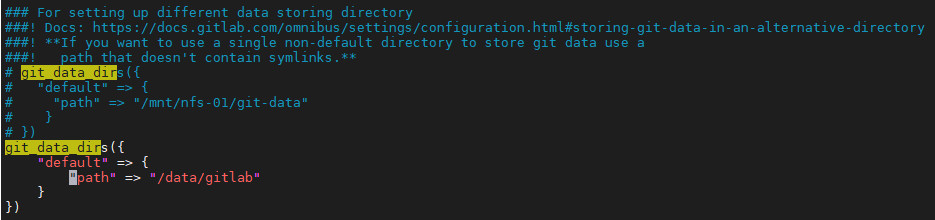

# 配置

## 修改存储位置

### Postgresql

GitLab内置的Postgresql的数据文件默认存储在```/var/opt/gitlab/postgresql/data```中。按照如下步骤其位置

将```/var/opt/gitlab/postgresql/data```同步到指定位置，这里设置为```/data/gitlab```

```bash
sudo rsync -av /var/opt/gilab/postgresql /data/gitlab
```

打开```/etc/gitlab/gitlab.rb```，按照下面的代码修改配置
```ruby
postgresql['dir'] = "/data/gitlab/postgresql"
postgresql['data_dir'] = "/data/gitlab/postgresql/data"
postgresql['home'] = "/data/gitlab/postgresql"
```

停止gitlab
```bash
sudo gitlab-ctl stop
```

重新应用配置

```bash
sudo gitlab-ctl reconfigure
```

启动gitlab
```bash
sudo gitlab-ctl start
```

删除原来的数据文件
```bash
sudo rm -rf /var/opt/gitlab/postgresql/*
```

### 仓库

打开```/etc/gitlab/gitlab.rb```, 找到```# git_data_dirs```，如图修改配置



关闭gitlab

```bash
sudo gitlab-ctl stop
```

同步原仓库目录到新仓库目录

```bash
sudo rsync -av /var/opt/gitlab/git-data/repositories /data/gitlab
```

重新应用配置

```bash
sudo gitlab-ctl reconfigure
```

启动gitlab
```bash
sudo gitlab-ctl start
```