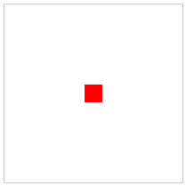
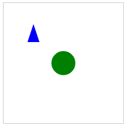
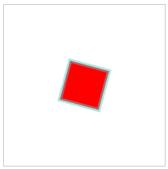
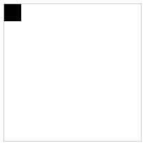
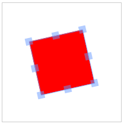
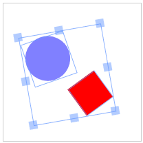
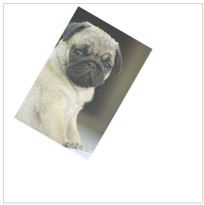
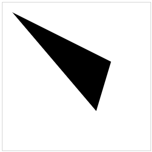
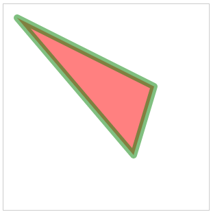
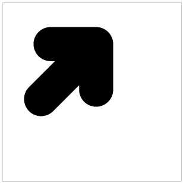

<!-- TOC -->

- [Fabric.js 介绍 (一)](#fabricjs-介绍-一)
  - [为什么使用Fabric？](#为什么使用fabric)
  - [Objects](#objects)
    - [对对象进行操作](#对对象进行操作)
    - [缺省设置](#缺省设置)
    - [层次结构和继承](#层次结构和继承)
  - [Canvas](#canvas)
    - [交互性](#交互性)
  - [图像](#图像)
  - [路径](#路径)
  - [后续内容](#后续内容)

<!-- /TOC -->
# Fabric.js 介绍 (一)


Fabric.js，一个强大的javascript库，使HTML5 canvas工作变得轻而易举。Fabric为canvas提供了缺失的对象模型，以及一个SVG解析器，交互层和一套不可缺少的工具。它是开源项目，具有MIT授权，多年来有很多的贡献。

在发现使用原生cavnas API的痛苦后，Fabric于2010年开始。原来的作者为 [printio.ru](https://printio.ru/) 创建了交互式的设计编辑器——它的建立，使用户能够设计自己的服装。在过去，这种交互只存在于Flash应用中。直到现在，也很少有类库能够做到Fabric一样好。

让我们仔细看一看

## 为什么使用Fabric？

现如今，[画布]()允许我们在web上创建一些[绝对惊人的图形]()。但是他提供的API实在是太底层。在canvas上绘制一些图形是一件很简单的事情。但是当需要任意方式的交互，例如修改图像上的任意一的点或者绘制更多的复杂图形，事情就发生了巨大的变化。

Fabric的目的在于解决这一问题。

原生的canvas方法只允许我们发送简单的绘画命令，一味的修改整个canvas上的位图（bitmap）。想绘制一个矩形？要用```fileRect(left,top,width,height)```。想绘制一条线？要将```moveTo(left,top)```和```lineTo(x,y)```一起使用。就好像我们用画笔在画布上作画一样，只能将颜料一层一层的涂上去，几乎无法控制。

对比如此低级的操纵，Fabric在原生方法的基础上提供简单且强大的对象模型。它关注画布状态(state)和渲染(rendering),并且让我们可以直接使用`object`。

我们用一个个简单的例子来展示其中的不同。比如，我们想在画布上绘制一个红色的矩形。使用原生`<canvas>`的API，我们这样做

```javascript
// 引用<cavnas></cavnas>元素 (其中"c"是cavnas元素的标签id)
var canvasEl = document.getElementById('c');

// 获取一个2d的绘图上下文（前面提到的"位图"）
var ctx = canvasEl.getContext('2d');

// 在上下文中设置填充颜色
ctx.fillStyle = 'red';

// 创建一个坐标位于100,100；尺寸是20x20的矩形
ctx.fillRect(100, 100, 20, 20);
```

再来看一下使用Fabric的做法

```javascript
// 创建一个原生canvas元素的封装对象（其中"c"是cavnas元素的标签id）
var canvas = new fabric.Canvas('c');

// 创建一个矩形对象
var rect = new fabric.Rect({
  left: 100,
  top: 100,
  fill: 'red',
  width: 20,
  height: 20
});

// 将矩形对象添加到canvas上
canvas.add(rect);
```



两个例子都太简单了，在这一点上他们几乎没有区别。然而，已经可以看出两者在canvas的处理方式有多么的不同。使用原生方法，我们操作上下文(context)——这是一个代表整个canvas位图的对象。而在Fabric，我们操作对象——比如，修改他们的属性，将他们添加到canvas上。你可以将这些对象看作Fabric世界中的一等公民。

只绘制一个红色矩形太单调了。还可以对它做一些有意思的事情。比如旋转45°角。先用原生`<canvas>`方法实现：

```javascript
var canvasEl = document.getElementById('c');
var ctx = canvasEl.getContext('2d');
ctx.fillStyle = 'red';

ctx.translate(100, 100);
ctx.rotate(Math.PI / 180 * 45);
ctx.fillRect(-10, -10, 20, 20);
```

再用Fabric

```javascript
var canvas = new fabric.Canvas('c');

// 创建一个旋转45°角的矩形
var rect = new fabric.Rect({
  left: 100,
  top: 100,
  fill: 'red',
  width: 20,
  height: 20,
  angle: 45
});

canvas.add(rect);
```


发生了什么？

在Fabric中，我们要做的就是，将对象的```angle```的值设置为```45```。而原生方法，事情就变得更有“操作乐趣”。注意到没有，我们不能操作对象，反而调整了整个画布的位置和角度(```ctx.translate```,```ctx.rotate```)来适应需求。然后再绘制矩形，但是需要注意偏移位图（-10，-10），这样它仍然再100，100处绘制。在旋转它的时候，我们还需要做将角度转换为弧度（Math.PI / 180 * 45）这种额外的动作。

我相信，你已经开始明白为什么Fabric会存在，以及它隐藏多多少低级的引用了。

但是我们还要再看一些其他的例子——持续跟踪canvas的状态。

如果在某个时候，我们想把红色矩形再画布上稍微移动到其他位置？如何在不能操作对象的情况下实现？再调用一次canvas位图的```fillRect``方法?

这样不行，再调用一次```fillRect```实际上是在已经绘制了内容的画布上再绘制一个矩形。还记的前面提到的使用刷子绘画吗？为了移动它，我们首先需要擦除之前绘制的内容，然后再新的位置重新绘制一个矩形。

```javascript
var canvasEl = document.getElementById('c');

...
ctx.strokRect(100, 100, 20, 20);
...

// erase entire canvas area
// 擦除整个画布区域
ctx.clearRect(0, 0, canvasEl.width, canvasEl.height);
ctx.fillRect(20, 50, 20, 20);
```

用Fabric实现

```javascript
var canvas = new fabric.Canvas('c');
...
canvas.add(rect);
...

rect.set({ left: 20, top: 50 });
canvas.renderAll();
```


注意一个非常重要的区别。使用Fabric，不需要在修改任何内容之前擦除之前的内容。我们仍然使用对象，只要修改它的属性，然后重绘，就得到了新的图片。

## Objects

我们已经看，使用如何通过实例化```fabric.Rect```来使用矩形。当然Fabric也覆盖了所有其他的基本形状——圆，三角，椭圆等等。所有这些被封装在```fabric```命名空间，比如```fabric.Circle```，```fabric.Triangle```，```fabric.Ellipse```，等等。

Fabric提供了7中基础形状。
- [fabric.Circel](http://fabricjs.com/docs/fabric.Circle.html)
- [fabric.Ellipse](http://fabricjs.com/docs/fabric.Ellipse.html)
- [fabric.Line](http://fabricjs.com/docs/fabric.Line.html)
- [fabric.Polygon](http://fabricjs.com/docs/fabric.Polygon.html)
- [fabric.Polyline](http://fabricjs.com/docs/fabric.Polyline.html)
- [fabric.Rect](http://fabricjs.com/docs/fabric.Rect.html)
- [fabric.Triangle](http://fabricjs.com/docs/fabric.Triangle.html)l

想绘制圆？只要创建circle对象，添加到cavnas上。其他形状也是一样

```javascript
var circle = new fabric.Circle({
  radius: 20, fill: 'green', left: 100, top: 100
});
var triangle = new fabric.Triangle({
  width: 20, height: 30, fill: 'blue', left: 50, top: 50
});

canvas.add(circle, triangle);
```



如上图，我们在100，100的位置绘制了一个绿色的圆，在50，50的位置绘制了一个蓝色的三角。

### 对对象进行操作

创建图形对象——矩形、圆、和其他图形——只是开始。在某些情况下，我们可能需要修改这些对象。可能跟踪状态的变化，或播放某些动画。或者我们需要在特定的鼠标交互中修改对象的属性（颜色、透明度、尺寸、位置）

Fabric为我们解决的画布的渲染和状态管理。我们只需要修改对象本身。

前面的演示了`set`方法和如何调用`set({left:20, top:50})`将对象从之前的位置移动。按照同样的方式，我们可以修改对象的其他属性。那么都有那些属性呢？

正如你所期望的，这些都与定位——**left**，**top**；尺寸——**width**，**height**；渲染——**fill**，**不透明度**，**描边**，**描边宽度**；缩放和旋转——**scaleX**，**scaleY**，**angle**；甚至翻转—— **flipX**，**flipY**和变换—— **skweX**，**skewY**。

是的，在Fabric创建翻转对象只需要简单将`flip*`属性设置为`true`。

你可以通过`get`方法读取任何属性，通过`set`方法设置他们。让我们来试着修改红色矩形的一些属性

```javascript
var canvas = new fabric.Canvas('c');
...
canvas.add(rect);

rect.set('fill', 'red');
rect.set({ strokeWidth: 5, stroke: 'rgba(100,200,200,0.5)' });
rect.set('angle', 15).set('flipY', true);
```



首先，我们将`fill`设置为红色，本质上是使对象的颜色为红色。下一个语句设置`strokeWidth`和`stroke`的值，给矩形5个像素的淡绿色色描边。最后，我们修改`angle`和`flipY`属性。注意，三个语句如何使用稍有不同的语法。

这说明了`set`是一个常用的方法。你可能经常使用它，这也意味着它会尽可能的方便使用

我们讨论了图形对象属性的设置器，那么获取器呢？很明显的，我们有通用的`get`方法，但是也有特定的`get*`方法。你可以使用`get('width')`或者`getWidth()`获取图形对象的`width`属性的值，使用`get('scaleX')`或者`getScaleX()`获取`scaleX`的值，等等。没有个图形对象的公共属性都有类似`getWidth`和`getScalex`的方法（`stroke`,`strokeWidth`,`angle`,等）

你可能已经注意到，前面的例子中，对象是使用与我们在`set`方法相同的配置散列（configuration hash）创建的。这是因为他们的确是一样的。你可以在创建的时候配置对象，也在后面使用`set`方法修改他们。

```javascript
var rect = new fabric.Rect({ width: 10, height: 20, fill: '#f55', opacity: 0.7 });

// or functionally identical

var rect = new fabric.Rect();
rect.set({ width: 10, height: 20, fill: '#f55', opacity: 0.7 });
```

### 缺省设置

这是个时候，你可能会问——创建对象时如果不传递任何的配置对象，会怎么样？仍然会有那些属性吗？

当然会有，Fabric中的对象的属性都有一组默认属性。创建过程中省略配置时，它就是给定对象类型的默认属性集。我们来试一下。

```javascript
var rect = new fabric.Rect(); // notice no options passed in

rect.get('width'); // 0
rect.get('height'); // 0

rect.get('left'); // 0
rect.get('top'); // 0

rect.get('fill'); // rgb(0,0,0)
rect.get('stroke'); // null

rect.get('opacity'); // 1
```

上面绘制的矩形获取了默认属性集。它被放置在0，0点，黑色，完全不透明，没有描边和尺寸(宽度和高度都是0)。因为没有尺寸，所以不能再画布上看到它。但只要这只了大于0的长度和宽度值，就能看到一个黑色矩形出现在画布的左上角。



### 层次结构和继承

Fabric对象不是独立存在的。他们来自一个非常精确的等级制度

大部分的对象从根结构`fabric.Object`继承。`fabric.Object`基本代表一个防止在二维画布平面行的二维图形。它是实体，具有`left`/`top`和`width`/`height`属性,以及一系列其他图形特性。这些我们在对象上看到过的属性——`fill`，`stroke`，`angle`，`opacity`，`flip*`等等——是所有继承自`fabric.Object`的Fabric对象通用的。

这种继承允许我们在`fabric.Object`上定义方法，并在所有子类之间共享。比如，如果你希望所有对象上都有一个`getAngleInRadians`方法，可以简单的在`fabric.Object.prototype`上创建它。

```javascript
fabric.Object.prototype.getAngleInRadians = function() {
  return this.get('angle') / 180 * Math.PI;
};

var rect = new fabric.Rect({ angle: 45 });
rect.getAngleInRadians(); // 0.785...

var circle = new fabric.Circle({ angle: 30, radius: 10 });
circle.getAngleInRadians(); // 0.523...

circle instanceof fabric.Circle; // true
circle instanceof fabric.Object; // true
```

就像你看到的，所有实例可以立即使用方法。

当子类从`fabric.Object`继承时，它们往往定义自己的方法和属性。比如，`fabric.Circel`需要一个`radius`属性，`fabric.Image`——稍后我们会提到——需要`getElement`/`setElement`方法来访问或设置Image实例产生的``元素。

在高级项目中，使用原型类获得定制呈现和行为是非常常见的。

## Canvas

现在我们更详细的介绍了对象，让我们回来讨论画布。

所有Fabric的例子中可以看到的第一件事就是——`new fabric.Canvas('...')`。`fabric.Canvas`作为`canvas`元素的封装器，负责管理在该画布上的所有fabric对象。它接受一个元素的`id`属性，并返回一个`fabric.Canvas`实例。

我们可以向它`add`对象，通过它引用对象，或者移除对象。
```javascript
var canvas = new fabric.Canvas('c');
var rect = new fabric.Rect();

canvas.add(rect); // add object

canvas.item(0); // reference fabric.Rect added earlier (first object)
canvas.getObjects(); // get all objects on canvas (rect will be first and only)

canvas.remove(rect); // remove previously-added fabric.Rect
```

虽然管理对象是`fabric.Canvas`的主要用途，但它同样也是一个配置宿主。为整个画布设置背景色或者背景图片，从中剪切某一个区域，设置不同的宽度和高度，指明画布是否可交互的。在`fabric.Canvas`创建或之后的任何时候，所有这些操作（和其他操作）都可以在它上面设置。

```javascript
var canvas = new fabric.Canvas('c', {
  backgroundColor: 'rgb(100,100,200)',
  selectionColor: 'blue',
  selectionLineWidth: 2
  // ...
});

// or

var canvas = new fabric.Canvas('c');
canvas.setBackgroundImage('http://...');
canvas.onFpsUpdate = function(){ /* ... */ };
// ...
```

### 交互性

既然谈到了canvas元素，我们来谈一谈交互性。Fabric的其中一个独特的特性——内置的——就是我们刚刚看到所有方便的对象模型之上的交互层。

对象模型的存在可以用变成的方式的访问和操作画布上的对象。而从外部来看，在用户层面上，有一种方法可以通过鼠标（或者触摸设备上的触摸）操作这些对象。一但通过`new fabric.Canvas('...')`初始化`canvas`对象后，可以选择对象，拖动、缩放或者旋转它们，甚至将他们组合在一起后操作它们的分组。





如果我们希望用户能够在画布上拖拽东西，比如一张图片，我们要做的的就是初始化`canvas`，然后将图形对象添加到上面。不需要多余的配置或设置。

为了控制这种交互性，我们可以结合单个对象的`selection`布尔属性在画布上使用Fabric的`selectable`布尔属性。
```javascript
var canvas = new fabric.Canvas('c');
...
canvas.selection = false; // disable group selection
rect.set('selectable', false); // make object unselectable
```

如果根本不想要这个交互层，你可以用`fabric.StaticCanvas`代替`fabric.Canvas`。初始化语法是完全相同的。你只需要将用`StaticCanvas`替换`Canvas`。
```javascript
var staticCanvas = new fabric.StaticCanvas('c');

staticCanvas.add(
  new fabric.Rect({
    width: 10, height: 20,
    left: 100, top: 100,
    fill: 'yellow',
    angle: 30
  }));
```

这创建了一个轻量级的canvas，没有任何事件处理逻辑。注意，你仍然有完整的对象模型要处理——添加对象，移除或者修饰它们，也可以修改画布的任何配置——所有这些都可以工作。只是没有了事件处理。

稍后，我们回顾自定义构建选项时，你会看到，如果StaticCanvas满足所有的需求，你甚至可以创建Fabric的轻量版。如果你的应用需要一些非交互图表，或者带有滤镜效果非交互图片，那么这可能是一个不错的选择。

## 图像

说到图像...

在画布上添加矩形和圆很有趣，但为什么不尝试一些图像呢？正如你现在所想象的，Fabric使这变得非常容易。我们来实例化`fabric.Image`对象并添加到画布上。

(html)
```html
<canvas id="c"></canvas>

```
(js)
```javascript
var canvas = new fabric.Canvas('c');
var imgElement = document.getElementById('my-image');
var imgInstance = new fabric.Image(imgElement, {
  left: 100,
  top: 100,
  angle: 30,
  opacity: 0.85
});
canvas.add(imgInstance);
```

注意我们使如何将一个image元素传递给`fabric.Image`构造器。这段代码创建一个`fabric.Image`实例，与文档中的图像相似的图像。此外，我们立即将`left`/`top`的值设置为100/100,`angle`设置为30，`opactiy`设置为0.85。一但添加到画布上,一个图片会在100,100的位置渲染，30°角，并且稍微透明。



现在，如果文档中没有图片，但有图片的URL怎么办？没问题，让我们看看如何使用`fabric.Image.fromURL`：

```javascript
fabric.Image.fromURL('my_image.png', function(oImg) {
  canvas.add(oImg);
});
```

是不是看起来很简单？只需要使用图片的URL作为参数调用`fabric.Image.fromURL`，在提供一个在加载和创建图像时调用的回调函数。这个回调函数接收一个创建好的`fabric.Image`对象作为第一个参数。这是，你可以把它添加到画布上，或者可能先修改再添加到画布上：

```javascript
fabric.Image.fromURL('my_image.png', function(oImg) {
  // scale image down, and flip it, before adding it onto canvas
  oImg.scale(0.5).set('flipX', true);
  canvas.add(oImg);
});
```

## 路径

我们谈论了简单图形和图片。那么更复杂，更丰富的图形和内容呢？

来看看更牛逼的一对搭档——路径和分组。

Fabric路径表示一个图形的轮廓，这个图形可以填充、描边或者通过其他方法修改。路径由一些列的命令组成，实际上就是模拟一支钢笔从一个点到另外一个点的运动。在诸如`move`，`line`，`curve`或者`arc`等这些命令的帮助下，路径可以构成难以置信的复杂图形。并且在路径组（PathGroup）的帮助下，可能性会更大。

Fabric中的路径与[SVG的`<path>`元素](http://www.w3.org/TR/SVG/paths.html#PathElement)非常类似。它们使用相同的命令，可以从`<path>`元素创建，也可以序列化成`<path>`元素。我们稍后会更详细的研究序列化以及SVG解析，但现在值得一提的是，你可能很少手工创建Path实例。相反的，你会使用Fabric的内置svg解析器。但为了理解路径对象，我们试着手工创建一个简单的路径。
```javascript
var canvas = new fabric.Canvas('c');
var path = new fabric.Path('M 0 0 L 200 100 L 170 200 z');
path.set({ left: 120, top: 120 });
canvas.add(path);
```


我们实例化了一个`fabric.Path`对象，向它传递一串路径指令。它虽然看起来很神秘，但其实很容易理解。“M”表示“move”命令，告诉无形的港币移动到0,0点。“L”代表“line” 让钢笔画一条直线到200,100点。然后另外一个“L”创建一条到170,200的直线。最后，“Z”告诉钢笔关闭当前路径并最终确定形状。结果，我们得到一个三角形。

因为`fabric.Path`和其他Fabric对象一样，我们同样可以修改它的一些属性。但我们可以进一步修改它：

```javascript
...
var path = new fabric.Path('M 0 0 L 300 100 L 200 300 z');
...
path.set({ fill: 'red', stroke: 'green', opacity: 0.5 });
canvas.add(path);
```



处于好奇，我们来看看稍微负责一些的路径语法。你会明白，为什么手动创建路径不是一个好主意。

```javascript
...
var path = new fabric.Path('M121.32,0L44.58,0C36.67,0,29.5,3.22,24.31,8.41\
c-5.19,5.19-8.41,12.37-8.41,20.28c0,15.82,12.87,28.69,28.69,28.69c0,0,4.4,\
0,7.48,0C36.66,72.78,8.4,101.04,8.4,101.04C2.98,106.45,0,113.66,0,121.32\
c0,7.66,2.98,14.87,8.4,20.29l0,0c5.42,5.42,12.62,8.4,20.28,8.4c7.66,0,14.87\
-2.98,20.29-8.4c0,0,28.26-28.25,43.66-43.66c0,3.08,0,7.48,0,7.48c0,15.82,\
12.87,28.69,28.69,28.69c7.66,0,14.87-2.99,20.29-8.4c5.42-5.42,8.4-12.62,8.4\
-20.28l0-76.74c0-7.66-2.98-14.87-8.4-20.29C136.19,2.98,128.98,0,121.32,0z');

canvas.add(path.set({ left: 100, top: 200 }));
```

天啊，这是怎么回事？

好吧，“M”仍然代表“move”命令，所以钢笔开始从121.32,0点开始绘制。之后，“L”命令移动到了44.58,0。到目前还好。下一个是啥？“C”命令，代表“三次贝塞尔（cubic bezier）”。它令钢笔从当前点到36.67,0绘制贝塞尔曲线。它使用29.5,3.22作为线开始的控制点，使用24.31,8.41作为线结束的控制点。之后的整个过程有一堆其他的三次贝塞尔命令，最终创建一个好看的箭头形状。



你可能没有机会直接跟这些“野兽”一起工作。相反的，你可能更想用`fabric.loadSVGFromString`或者`fabric.loadSVGFromURL`两个方法加载整个SVG文件，让Fabric的SVG解析器遍历所有SVG元素并创建相应的路径对象。

说到整个SVG文档，虽然Fabric的Path通常代表SVG的\<path\>元素，在SVG文档中出现的路径集合表示Groups(`fabric.Group`实例)。正如你想象到的，Group只是一组路径和其他对象的组合。因为`fabric.Group`从`fabric.Object`继承，它与其他对象一样，可以添加到画布上，并以同样的方式操作它。

如同使用Path，你可能不会直接使用它们。但如果在解析SVG文档后偶然发现一个Group对象，你会确切的了解它是什么，以及它的用途。

## 后续内容

我们只是触及了Fabric的表层。现在可以轻松的创建任何简单图形，复杂图形，图片；将它们添加到画布，并使用你希望的任何方法修改它（位置，尺寸，角度，颜色，描边，不透明度）。

在本系列的下一部分，我们研究以下分组，动画，文本，SVG解析器，渲染，徐丽华，事件，图片路径等等。

同时，随意查看[带注释的演示](http://fabricjs.com/demos/)或者[基准测试程序](http://fabricjs.com/benchmarks/)，加入[谷歌小组](https://groups.google.com/forum/?fromgroups#!forum/fabricjs)或[其他地方](http://stackoverflow.com/questions/tagged/fabricjs)的讨论，或者直接查看[文档](http://fabricjs.com/docs/)，[wiki](https://github.com/kangax/fabric.js/wiki)和[源码](https://github.com/kangax/fabric.js)。

尽情体验面料吧! 我希望你喜欢这次旅程。

阅读[第二部分](fabric介绍_2.md)