<!-- TOC -->

- [Fabric.js 介绍 (二)](#fabricjs-介绍-二)
  - [动画 (寂寞难耐的时候需要浪一下)](#动画-寂寞难耐的时候需要浪一下)
  - [图像滤镜](#图像滤镜)
  - [颜色](#颜色)
  - [渐变](#渐变)
  - [文本](#文本)
    - [fontFamily (字体)](#fontfamily-字体)
    - [fontSize (字体尺寸)](#fontsize-字体尺寸)
    - [fontWeight (字体粗细)](#fontweight-字体粗细)
    - [textDecoration (文本修饰)](#textdecoration-文本修饰)
    - [shadow (阴影)](#shadow-阴影)
    - [fongStyle (字形)](#fongstyle-字形)
    - [stroke (描边) 和 strokeWidth (描边宽度)](#stroke-描边-和-strokewidth-描边宽度)
    - [textAlign (文本对齐)](#textalign-文本对齐)
    - [lineHeight (行高)](#lineheight-行高)
    - [textBackgroundColor (文本背景色)](#textbackgroundcolor-文本背景色)
  - [Event (事件)](#event-事件)

<!-- /TOC -->

# Fabric.js 介绍 (二)

在第一部分中，我们开始熟悉Fabric.js，研究使用Fabric.js的原因，它的对象模型和对象层次结构以及Fabric.js中可用的不同种类的实体——简单形状、图像和复杂路径。我们也学习了如何在canvas中使用Fabric对象执行简单的操作。

现在大部分基础的东西都搞定了，来一起找点乐子。

## 动画 (寂寞难耐的时候需要浪一下)

二货canvas库都没有动画功能。但Fabric.js比较牛逼，吊炸天的对象模型和绘画能力，如果不内置动画助手。。。地缝在哪里！

改变对象属性用Fabricjs对象的set方法就行，简单吧。

```js
rect.set('angle',45)
```

让对象们浪起来也简单，调用Fabric对象的animate方法就行。

```js
rect.animate('angle', 45, {
  onChange: canvas.renderAll.bind(canvas)
});
```

第一个参数是动画的属性名。第二个参数参数是这个属性的最终值。如果矩形的angle属性的初始值是-15°，传递的值是45，动画效果就是角度从-15°到45°的旋转。第三个参数是一个可选参数，指定了动画的更详细的信息，包括持续时间、回调、缓动等等。

animate方法支持相对值，比如，让一个对象的向右移动100px。

```js
rect.animate('left', '+=100', { onChange: canvas.renderAll.bind(canvas) });
```

再例如，将一个对象逆时针旋转5弧度

```js
rect.animate('angle', '-=5', { onChange: canvas.renderAll.bind(canvas) });
```

"onChange"回调中调用canvas.renderAll方法，可以看到让我们看到一帧中实际发生了什么。调用animate的时候，它只在一段时间内，使用特定的算法，根据指定的属性值的变化，生成动画效果。所以，```rect.animate('angle',45)```会修改对象的角度，但每次角度值变化后，不会重绘canvas。所以需要在属性值变化时显示重绘，来观察实际的动画效果。

所有的对象都包含在fabric.Canvas中，每个对象都有自己的属性和关系。canvas只负责将他们的存在反应到界面上。

由于性能的原因，animate不会在每次属性值变化时重绘到canvas。在canvas上可能有成百上千的可动画对象，每个对象都重绘的话，效果不会好。好多好多对象耐不住寂寞时候，用类似requestAnimationFrame(或者其他基于计时器)的循环来持续不断的让他们自己在画布上浪，就不要用renderAll让其他对象也陪着他们浪了。不过，多数情况下，还是需要想"onChange"回调一样，显示的用renderAll让所有对象出来浪一下。

传递给animate的第三个参数中的内容还有其他选项：
- from：当不想使用属性的当前值时，可以指定动画的开始值。
- duration：默认值是500ms，可以用来改变持续动画的持续时间。
- onComplete：动画结束时的回调函数
- easing：缓动方法

着重看一下easing这个选项。默认情况下，animate方法使用"easeInSine"的缓动效果。```fabric.util.ease```中提供了大量的缓动函数。比如想让一个对象有弹性的从左侧移动到右侧，可以使用```fabric.util.ease.easeOutBounce```

```js
rect.animate('left', 500, {
  onChange: canvas.renderAll.bind(canvas),
  duration: 1000,
  easing: fabric.util.ease.easeOutBounce
});
```

其他常用的缓动选项还有```easeInCubic```,```easeOutCubic```,```easeInElastic```,```easeOutElastic```,```easeInBounce```,```easeOutExpo```。

以上这些包含了Fabric的动画功能的所有内容，用它改变对象的'angle'属性，可以让对象转起来；改变'left'/'right'属性,让对象飘来飘去；改变'width'/'height',让对象伸缩起来；改变'opacity'属性,让对象淡入淡

## 图像滤镜
第一部分介绍过，Image对象可以用fabric.Image构造函数从一个元素创建，或者使用fabric.Image.fromURL从图片的url创建。并且所有image对象都可以向其他对象一样在canvas上渲染。

我们可以在Image对象上应用图像滤镜。

Fabric为支持WEBGL的浏览器和不支持WEBGL的浏览器提供了一些滤镜。也可以很容易的自定义。一些内置的滤镜会比较熟悉，比如，去除白色背景，灰度，反转和亮度等。其他可能不太常用——颜色矩阵，复古，降噪。

fabric.Image对象有一个“filters”属性，一个存储了filter实例的数组。

来创建一个灰度图

```js
fabric.Image.fromURL('pug.jpg', function(img){
    // add filter
    img.filters.push(new fabric.Image.filters.Grayscale())

    // apply filters and re-render canvas when done
    img.applyFilters()
    // add image onto cavas (it also re-render the canvas)
    canvas.add(img)
})
```

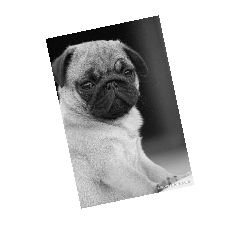

再来一个复古滤镜

```js
fabric.Image.fromURL('pug.jpg', function(img) {
  img.filters.push(new fabric.Image.filters.Sepia());
  img.applyFilters();
  // add image onto canvas (it also re-render the canvas)
  canvas.add(img);
});
```

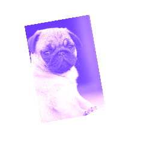

```fabric.Image.filters```是一个数组，可以向其中添加(通过push、splice、unshift)滤镜，也可以从中删除(通过pop、splice、shift)滤镜，甚至组合多个滤镜。调用```applyFilters```的时候，数组中的滤镜按顺序应用到图像上。

来个复古+亮度(bright)滤镜的图片

```js
fabric.Image.fromURL('pug.jpg', function(img) {
  img.filters.push(
    new fabric.Image.filters.Sepia(),
    new fabric.Image.filters.Brightness({ brightness: 100 }));

  img.applyFilters();
  canvas.add(img);
});
```

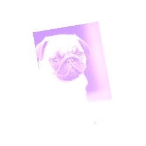

注意，我们传递了```{ brightness: 100 }```对象到Brightness过滤器。一些过滤镜不需要任何配置信息(如灰度、反色、复古)，还有一些滤镜可以通过配置信息更好的控制自己的行为。对于亮度滤镜， 需要设置实际的亮度级别(-1全黑到1全白)；对于降噪滤镜，设置降噪值(0-1000)；对于去色滤镜设置阈值距离值；等等。

创建滤镜的模板非常简单。先创建一个类，然后定义```applyTo```方法。我们可以给滤镜添加```toJSON```方法。也可以定义```initialize ```来传递可选的参数。

```js
fabric.Image.filters.Redify = fabric.util.createClass(fabric.Image.filters.BaseFilter, {

  type: 'Redify',

  /**
   * Fragment source for the redify program
   */
  fragmentSource: 'precision highp float;\n' +
    'uniform sampler2D uTexture;\n' +
    'varying vec2 vTexCoord;\n' +
    'void main() {\n' +
      'vec4 color = texture2D(uTexture, vTexCoord);\n' +
      'color.g = 0.0;\n' +
      'color.b = 0.0;\n' +
      'gl_FragColor = color;\n' +
    '}',

  applyTo2d: function(options) {
    var imageData = options.imageData,
        data = imageData.data, i, len = data.length;

    for (i = 0; i < len; i += 4) {
      data[i + 1] = 0;
      data[i + 2] = 0;
    }

  }
});

fabric.Image.filters.Redify.fromObject = fabric.Image.filters.BaseFilter.fromObject;
```

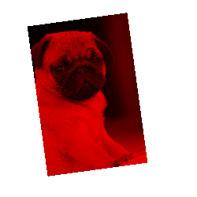

Redify的主要操作是在循环中发生的。我们用0替换每个像素的绿色值(data[i+1])和蓝色之(data[i+2])，rgb三原色中的红色值保持不变，实际上就是把整个图像涂成红色。正如看到的，在滤镜应用的过程中，传递了一个包含图像数据(```imageData```)的对象到```applyTo```方法。从中，我们可以遍历图片像素(```getImageData().data```)并修改他们。如果浏览器支持WEBGL，滤镜可以运行在GPU。要做到这一点，需要提供一个片元着色器(fragment shader),来描述在像素上完成的操作。在fabric的例子中，可以看到有很多定义滤镜的过程中如何编写片元/端点着色器

## 颜色

无论是哪种颜色表示方式，hex、RGB或者RGBA，Fabric提供了坚实的颜色基础，可以更加自然的表达自己。下面是一些在Fabric定义颜色的方法

```js
new fabric.Color('#f55')
new fabric.Color('#123123');
new fabric.Color('356735');
new fabric.Color('rgb(100,0,100)');
new fabric.Color('rgba(10, 20, 30, 0.5)');
```

转换也非常简单，```toHex()```可以将color实例对象转换为hex表示方式。```toRGB()```转换为RGB方式，```toRGBA()```将转换为RGBA方式。

```js
new fabric.Color('#f55').toRgb(); // "rgb(255,85,85)"
new fabric.Color('rgb(100,100,100)').toHex(); // "646464"
new fabric.Color('fff').toHex(); // "FFFFFF"
```

颜色转换只是最基本的操作。Fabric支持将一个颜色覆盖到另外一个颜色上，或者获取一个颜色的灰度版本。

```js
var redish = new fabric.Color('#f55');
var greenish = new fabric.Color('#5f5');

redish.overlayWith(greenish).toHex(); // "AAAA55"
redish.toGrayscale().toHex(); // "A1A1A1"
```

## 渐变

渐变是一种更有表现力的颜色处理方法，它能够将一种颜色混合到另外一种颜色中，创建一些令人惊叹的图形效果。

Fabric支持在所有对象上的填充和描边上的渐变设置。为了达到这种效果，需要创一个建渐变的对象，并将它设置到给某个对象的```fill```属性或者```store```属性

```js
var circle = new fabric.Circle({
  left: 100,
  top: 100,
  radius: 50
});

var gradient = new fabric.Gradient({
  type: 'linear',
  gradientUnits: 'pixels', // or 'percentage'
  coords: { x1: 0, y1: 0, x2: 0, y2: circle.height },
  colorStops:[
    { offset: 0, color: '#000' },
    { offset: 1, color: '#fff'}
  ]
})

circle.set('fill', gradient);
```

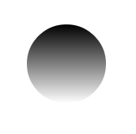

上图中，在100,100的位置创建了一半径为50px的圆，然后用一个从黑色到白色的跨越整个圆形高度的渐变，设置到它的填充上。

渐变的配置对象包含两个主要的属性：```coords```和```colorStops```。```coords```需要至少两个坐标对(x1,y1和x2,y2)来指定渐变如何延伸。```colorStop```是一个定义了渐变颜色的数组。其中的每个元素，都指定了该颜色在渐变延伸方向上出现的位置的```offset```属性，一个该位置展现的颜色的```color```属性和一个设置该颜色不透明度的```opacity```属性。你可以定义多个'color stops'，只是它们的```offset```属性值要在'0'~'1'之间。'0'代表渐变的开始位置，'1'代表结束位置。渐变的坐标是相对于图形对象外包矩形的坐上角位置的,所以圆的最高点是0，最低点是```circel.height```。你可以指定```linear```或者```radial```两种渐变类型，可以使用```gradientUnits```的默认值```pixels```或者指定为```percentage```。```percentage```表示```offset```的值是相对于图形对象尺寸的百分比，比如'1'表示整个图像尺寸的100%。这种设置对于宽度和高度随内容变化的```fabric.Text```对象很有用。

下面是从左到右的红蓝渐变的例子

```js
 var gradient = new fabric.Gradient({
    type: 'linear',
    gradientUnits: 'pixels', // or 'percentage'
    coords: { x1: 0, y1: 0, x2: circle.width, y2: 0 },
    colorStops:[
      { offset: 0, color: 'red' },
      { offset: 1, color: 'blue'}
    ]
  })
 // or in percentage
  var gradient = new fabric.Gradient({
    type: 'linear',
    gradientUnits: 'percentage',
    coords: { x1: 0, y1: 0, x2: 1, y2: 0 },
    colorStops:[
      { offset: 0, color: 'red' },
      { offset: 1, color: 'blue'}
    ]
  })
```

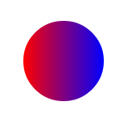

下面是一个每种颜色间隔20%，包含5种颜色的彩虹渐变。

```js
var gradient = new fabric.Gradient({
  type: 'linear',
  gradientUnits: 'pixels', // or 'percentage'
  coords: { x1: 0, y1: 0, x2: circle.width, y2: 0 },
  colorStops:[
    { offset: 0, color: 'red' },
    { offset: 0.2, color: 'orange' },
    { offset: 0.4, color: 'yellow' },
    { offset: 0.6, color: 'green' },
    { offset: 0.8, color: 'blue' },
    { offset: 1, color: 'purple' }
  ]
});
```

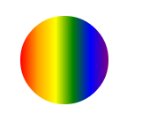

## 文本

除了images和矢量图形```fabric.Text```对象允许在canvas上绘制文本。

Fabric提供文本抽象的原因有两个。第一，它可以使用面向对象的方式工作。原生的canvas方法只在底层对文本进行填充或者描边。通过创建```fabric.Text```的实例，我们可以像其他Fabirc对象一样操作文本，比如移动、缩放、修改属性等等。

第二个原因是为了提供比canvas更丰富的功能，其中包括：
- 多行支持(Multiline support)：原生的canvas文本方法会忽略新行。
- 文本对齐(Text alignment)：左对齐、居中对齐、右对齐。多行文本时更有用。
- 文本背景(Text background)：背景也会考虑到文本对齐。
- 文本装饰(Text decoration)：下划线，上划线，删除线。
- 行高(Line height)：在多行文本时很有用。
- 字符间距(Char spacing)：使文本更加紧凑或者更加松散
- 附属区域(Subranges)：将颜色和属性应用到文本对象的附属区域。
- 多字节(Multibyte)：支持表情符号。
- 在画布上编辑文本(On canvas editiong)：通过交互类(interactive class)可以直接在画布上编辑文本。 

来看一个hello world例子

```js
var text = new fabirc.Text('hello world', { left: 100, top: 100 });
canvas.add(text)
```

看到了，要在画布上展示文本，只要简单将指定了位置的```fabric.Text```实例添加到```fabric.Canvas```实例。如你所见，构造实例的第一个参数是要展示的文本字符串。第二个参数是一个指定了```left```、```top```、```file```、```opacity```等常用属性的选项对象。

当然，```fabric.Text```的初始化选项中也有自己独特的文本相关的属性。让我们一起来看一下：

### fontFamily (字体)
```fabric.Text```的默认字体是“Times New Roman”，我们也可以改变```fontFamily```属性的值来渲染文本对象。对于它的修改，会立即使用新的字体渲染文本。

```js
var comicSansText = new fabric.Text("I'm in Comic Sans", {
    fontFamily: 'Comic Sans'
})
```

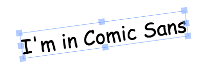

### fontSize (字体尺寸)
```fontSize```控制文本渲染的尺寸。它于其他Fabric的对象不同的是，不能直接修改文本的```width```/```height```属性。但可以通过改变```fongSize```的值来使文本更大或者更小。当然也可以使用```scaleX```/```scaleY```属性达到同样的目的。

```js
var text40 = new fabric.Text("I'm at fontSize 40", {
  fontSize: 40
});
var text20 = new fabric.Text("I'm at fontSize 20", {
  fontSize: 20
});
```

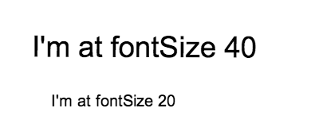

### fontWeight (字体粗细)

字体粗细可以设置文本看起来更粗或者更细。就像css一样，这个属性可以设置为关键字("normal","bold")，也可以设置为数字(100，200，300，400，600，800)。需要注意设置的粗细值取决于选择的字体是否可用。如果使用远程字体，需要确定字体定义了正常和粗体(或者任何其他需要的粗细)。

```js
var normalText = new fabric.Text("I'm a normal text", {
  fontWeight: 'normal'
});
var boldText = new fabric.Text("I'm at bold text", {
  fontWeight: 'bold'
});
```

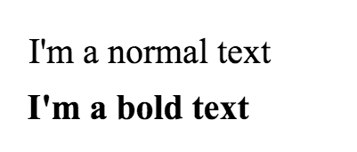

### textDecoration (文本修饰)

文本修饰是给文本上添加下划线，上划线，删除线。值的设置类似于CSS，但是Fabric允许用户将上述修饰组合在一起添加到文本上。所以一个文本可以同时有下划线和上划线，或者下划线和删除线等等。

```js
var underlineText = new fabric.Text("I'm an underlined text", {
  underline; true
});
var strokeThroughText = new fabric.Text("I'm a stroke-through text", {
  linethrough: true
});
var overlineText = new fabric.Text("I'm an overline text", {
  overline: true
});
```

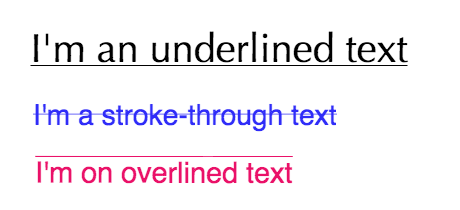

### shadow (阴影)

这个属性在1.3.0版本中是"textShadow"
文本阴影由四个部分组成：颜色(color)，水平偏移(horizontal offset)，垂直偏移(vertical offset)，模糊尺寸(blur size)。这个属性的工作方式很想CSS中的阴影，通过改变这些值，可以有多种组合方式。

```js
var shadowText1 = new fabric.Text("I'm a text with shadow", {
  shadow: 'rgba(0,0,0,0.3) 5px 5px 5px'
});
var shadowText2 = new fabric.Text("And another shadow", {
  shadow: 'rgba(0,0,0,0.2) 0 0 5px'
});
var shadowText3 = new fabric.Text("Lorem ipsum dolor sit", {
  shadow: 'green -5px -5px 3px'
});
```

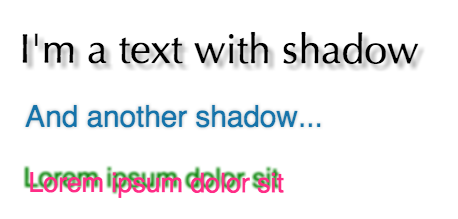

### fongStyle (字形)
Font Style可以设置为```normal```(正常)或```italic```(斜体)两个值中的任何一个。与CSS中同名的属性值类似

```js
var italicText = new fabric.Text("A very fancy italic text", {
  fontStyle: 'italic',
  fontFamily: 'Delicious'
});
var anotherItalicText = new fabric.Text("another italic text", {
  fontStyle: 'italic',
  fontFamily: 'Hoefler Text'
});
```

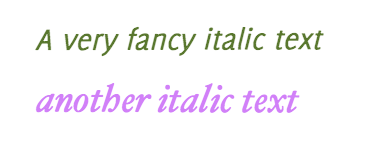

### stroke (描边) 和 strokeWidth (描边宽度)
通过设置描边(颜色)和描边宽度，能够在文本上实现一下有意思的效果。如下面两个例子所示：

```js
var textWithStroke = new fabric.Text("Text with a stroke", {
  stroke: '#ff1318',
  strokeWidth: 1
});
var loremIpsumDolor = new fabric.Text("Lorem ipsum dolor", {
  fontFamily: 'Impact',
  stroke: '#c3bfbf',
  strokeWidth: 3
});
```

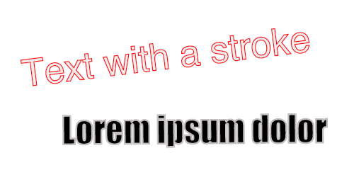

### textAlign (文本对齐)
文本对齐对于多行文本来说很有用。对于单行的文本，它的外包矩形总是与行宽度一致，所以不需要设置对齐。

属性接受的值包括```left```,```center```和```right```。

```js
var text = 'this is\na multiline\ntext\naligned right!';
var alignedRightText = new fabric.Text(text, {
  textAlign: 'right'
});
```

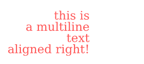

### lineHeight (行高)
这是与CSS中的lineHeight类似的另外一个属性。在多行文本中，它可以修改行之间的垂直距离。下面的例子中，第一个文本块的行高设置为3，第二个设置为1

```js
var lineHeight3 = new fabric.Text('Lorem ipsum ...', {
  lineHeight: 3
});
var lineHeight1 = new fabric.Text('Lorem ipsum ...', {
  lineHeight: 1
});
```

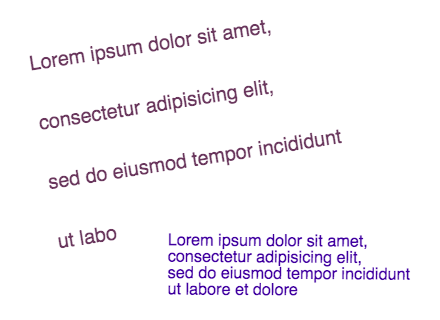

### textBackgroundColor (文本背景色)
最后，```textBackgroundColor```设置给定文本的背景。注意，背景色只填充到文本占用的空间，并不是整个外包矩形。这意味着文本对齐会改变文本背景的渲染方式。行高也是一样，背景不会填充到lineHeight属性创建的垂直空间。

```js
var text = 'this is\na multiline\ntext\nwith\ncustom lineheight\n&background';
var textWithBackground = new fabric.Text(text, {
  textBackgroundColor: 'rgb(0,200,0)'
});
```
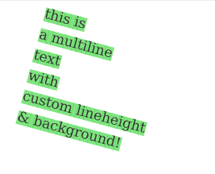

## Event (事件)
事件驱动架构是框架中某些惊人功能的和灵活性的基础。Fabric也不例外，并且提供了大量的事件系统，从底层的"鼠标"事件到高层的对象事件。

这些事件让我们能够利用画布上发生各种动作的不同时刻。比如想知道何时按下鼠标？订阅```mouse:down```事件。什么时候对象被添加到画布上？```object:added```事件告诉你。什么时候画布被重绘？使用```after:render```。

事件API很简单，有点像jQuery，Underscore.js或者其他流行的JS库。```on```方法用来初始化事件监听器，```off```方法来移除它。

我们来看一下实际的应用：

```js
var canvas = new fabric.Canvas('...');
canvas.on('mouse:diown', function(optionsj){
    console.log(options.e.clientX, options.e.clientY);
});
```

我们在canvas对象上添加```mouse:down```事件的监听器，并且给定一个事件处理函数，当事件出发时，会记录触发时的坐标值。换句话说，它会记录点击鼠标时的坐标值。这个事件处理函数接收一个包含两个属性的选项对象：```e```——一个事件对象，和```target```——一个canvas上的被点击的对象(如果有的话)。事件对象是一只存在的，但是只用当确实点击到画布上的某个对象是，```target```的值才存在，并且只传递给有意义的事件处理函数。例如，会传递给```mouse:down```，但不会传递给```after:render```(表示整个画布完成重绘)

```js
canvas.on('mouse:down', function(options) {
  if (options.target) {
    console.log('an object was clicked! ', options.target.type);
  }
});
```

上面的例子，会在点击一个对象时打印"an object was clicked!"，同时输出被点击的对象的而类型。

 那么，Fabric中还有那些其他事件呢？鼠标相关的事件包括```mouse:down```、```mouse:move```和```mouse:up```。常用的事件有```after:render```。与选择相关的事件有：```before:selection:cleared```、```selection:created```、```selection:cleared```。最有，对象相关的的事件有：```object:modify```、```object:selected```、```object:moving```、```object:scaling```、```object:roating```、```object:added```和```object:removed```

需要注意如```object:moveing```(或者```object:scaling```)类似的事件会在每次对象移动(或缩放)哪怕是一个像素时持续触发。另一方面，如同```object:modified```或者```selection:created```一样的事件，只会在行为(对象修改或选择创建)结束后触发。

还需要注意我们如何将事件附加到canvas对象(```canvas.on('mouse:down)```)。这意味着这些事件全部作用在canvas实例。如果有多个canvas，需要在每一个canvas上附加不同的事件监听器。每个监听器都是独立的，值关注分配给他们的事件。

为了方便，Fabric使事件系统跟进一步，可以直接在canvas对象上附加属性。

```js
var rect = new fabric.Rect({ width: 100, height: 50, fill: 'green' });
rect.on('selected', function(){
    console.log('selected a rectangle');
})

var circel = new fabric.Circle({radius: 75, fill: 'blue' });
circel.on('selected', function() {
    console.log('selected a circle');
})
```

我们直接向矩形和圆实例附加了事件监听器，使用```selected```替代```object:selected```。类似的，也可以使用```modified```事件(附加到canvas时的```object:modified```),```rotating```事件(附加到canvas时的```object:rotating```)等等。

