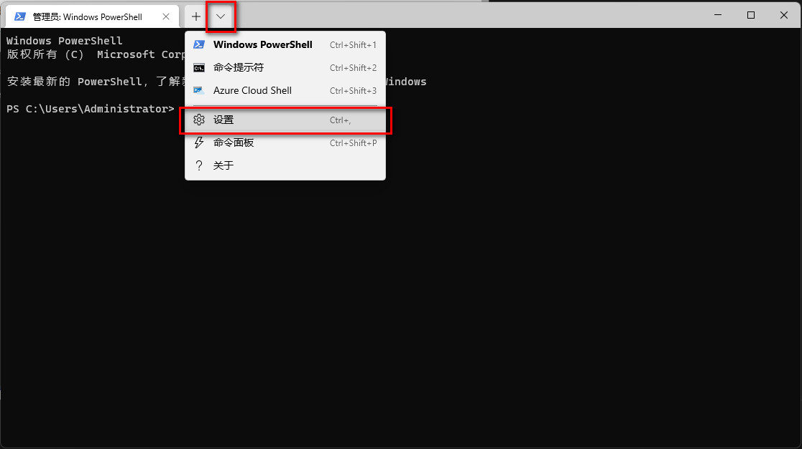
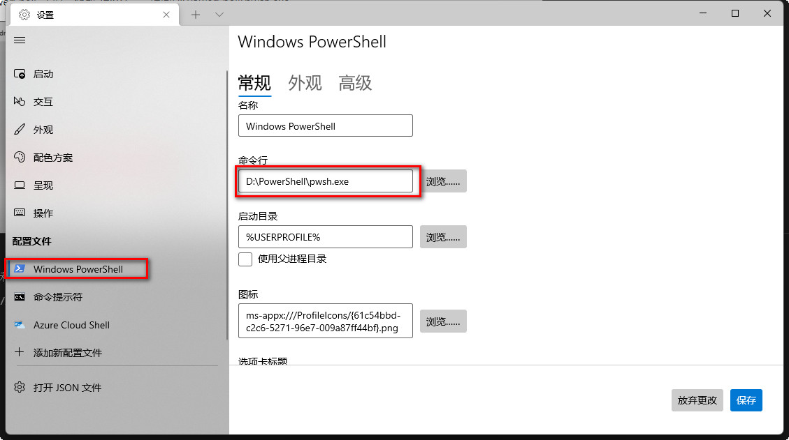
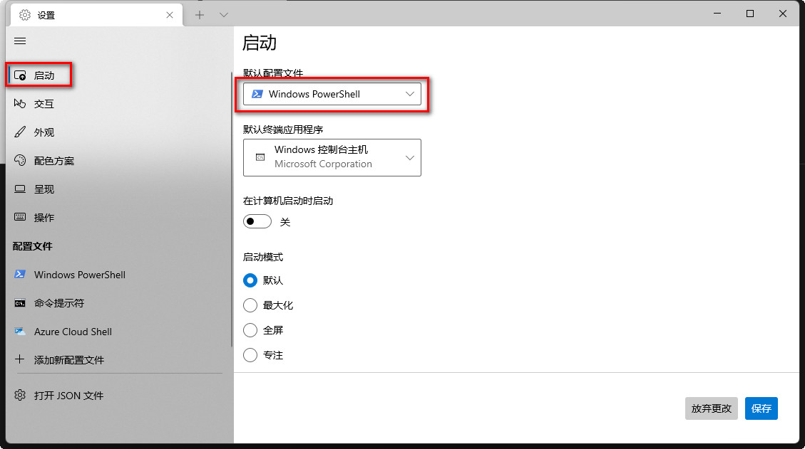
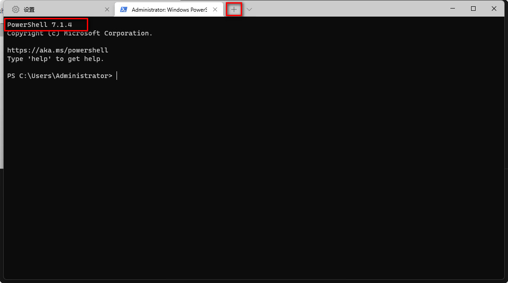

# 安装PowerShell 7并在windows终端中使用

## 安装PowerShell 7

从[下载地址](https://github.com/PowerShell/PowerShell/releases/tag/v7.1.4)下载zip包，下载完成后将zip包解压到指定位置

```batch
bz x -y -o:D:\PowerShell\ F:\Download\Chrome\PowerShell-7.1.4-win-x64.zip
```

## 在Windows终端中使用

`win+r`打开运行窗口，输入wt按回车键打开windows终端，打开“设置”



选择“配置文件”中的“Windows PowerShell”选项。修改“命令行”，指向D:\PowerShell\pwsh.exe



选择“启动”选项，修改“默认配置文件”为“Windows PowerShell”



打开新的标签页，可以看到，默认打开PowerShell 7.1.4。



